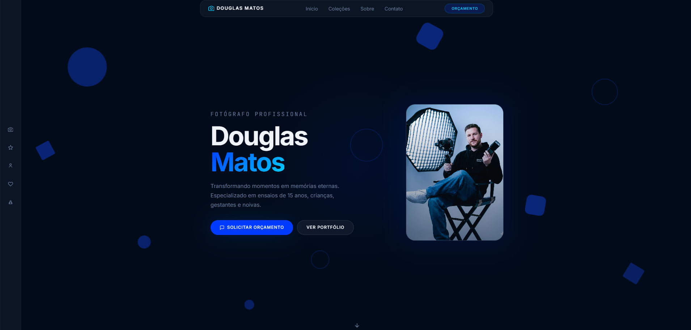
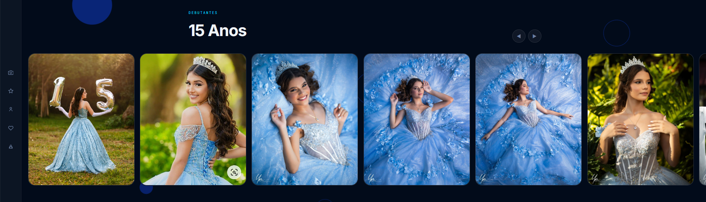
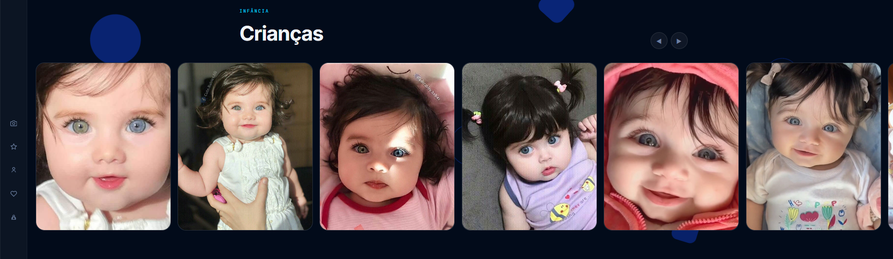
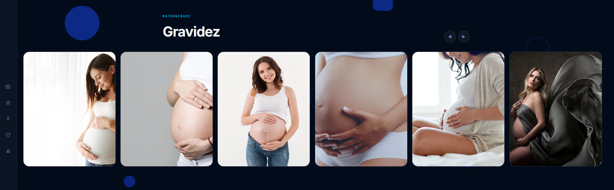
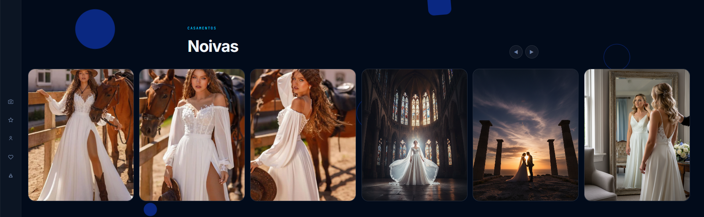
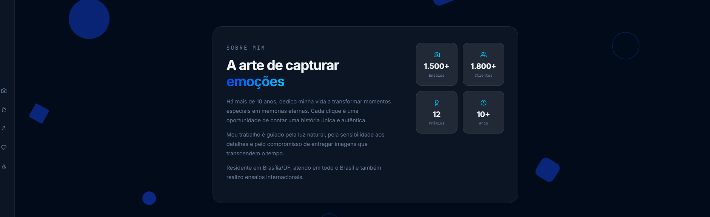
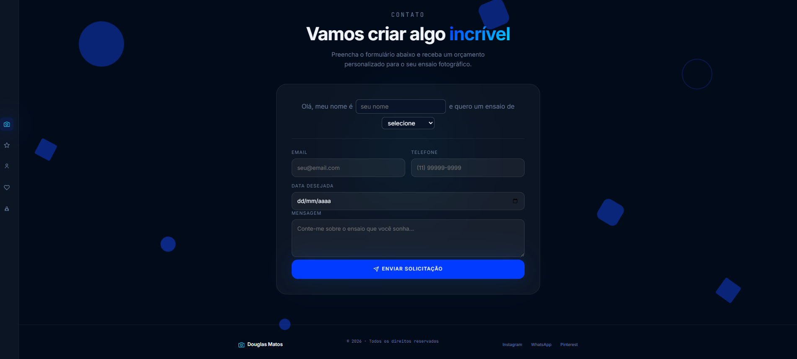

# Portfólio Douglas Matos – Fotógrafo Profissional


Um site de portfólio moderno e responsivo desenvolvido para o fotógrafo Douglas Matos, especializado em ensaios de 15 anos, crianças, gravidez e noivas. O projeto utiliza **glassmorphism**, galerias horizontais com rolagem por arrasto, zoom interativo, menu responsivo com sidebar de atalhos e um formulário de contato inovador no estilo **mad‑libs**. Foi criado como atividade acadêmica para a disciplina de Desenvolvimento Web, demonstrando o uso de CSS avançado, JavaScript puro e integração modular com Bootstrap 5.

## Screenshots

### Visão geral da página inicial


### Galeria de 15 anos


### Galeria de crianças


### Galeria de gravidez


### Galeria de noivas


### Seção sobre o fotógrafo 


### Formulário mad‑libs


## Sobre o Projeto

O projeto consiste em um site completo para apresentação do portfólio fotográfico de Douglas Matos, organizado em seções independentes: cabeçalho fixo com navegação, barra lateral com ícones de atalho, seção hero, quatro galerias de ensaios (15 anos, crianças, gravidez, noivas), seção sobre com estatísticas, formulário de contato e rodapé. Diferente de templates prontos, todas as interações foram implementadas manualmente com HTML5 semântico, CSS3 customizado e JavaScript puro.

O grande diferencial é a **galeria horizontal rolável com suporte a dois modos de navegação**: botões de avanço/recuo e arrasto direto com o mouse (drag to scroll). Cada imagem pode ser clicada para abrir um overlay de zoom suave. O efeito **glassmorphism** (vidro) é aplicado em menus, cards e formulário, conferindo um visual sofisticado.

O formulário de contato adota o estilo **mad‑libs**: uma frase interativa “Olá, meu nome é ______ e quero um ensaio de ______”, onde os espaços são preenchidos por um campo de texto e um menu suspenso. Após o envio simulado, uma mensagem de sucesso substitui o formulário.

## Tecnologias Utilizadas

- **HTML5** – estrutura semântica com seções, atributos `data-scroll` e integração de fontes.
- **CSS3** – variáveis customizadas, gradientes, animações keyframes, glassmorphism (`backdrop-filter`), flexbox, grid, media queries.
- **Bootstrap 5.3.8** – utilizado apenas para reset de estilos e alguns utilitários; o grid nativo não foi empregado.
- **JavaScript (ES6)** – geração dinâmica de elementos flutuantes, scroll suave, menu mobile, rolagem por arrasto, `IntersectionObserver`, zoom overlay, simulação de envio de formulário.

## Funcionalidades

- **Navegação fixa e fluida** – menu superior sempre visível, sidebar de atalhos com tooltips e destaque automático da seção atual.
- **Galeria rolável cross‑device** – cada seção possui faixa horizontal navegável por botões (nas duas últimas) ou arrasto com mouse; suporte a toque em dispositivos móveis.
- **Zoom interativo** – clique na imagem abre overlay escuro com imagem ampliada e transição suave.
- **Efeito glassmorphism** – aplicado aos menus, sidebar, cards e formulário.
- **Formulário mad‑libs** – preenchimento lúdico com frase aninhada, validação básica e simulação de envio com loading e mensagem de sucesso.
- **Elementos flutuantes animados** – formas geométricas (círculos, anéis, losangos, hexágonos) com animação infinita.
- **Design responsivo** – adaptação para desktops, tablets e smartphones (sidebar some, menu vira hambúrguer, formulário empilha).

## Detalhes Visuais

O projeto adota uma paleta escura (`--bg: #020B1A`) com textos claros (`--fg: #F0F4F8`) e destaques em ciano (`--accent: #00D1FF`).  

- **Glassmorphism**: classes `.glass` e `.glass-card` com fundo semi‑transparente e `backdrop-filter: blur(40px)`.  
- **Gradiente de texto**: título “Matos” no hero com `linear-gradient(135deg, #003BFF, #00D1FF)`.  
- **Botões**: `.btn-primary` (azul com glow) e `.btn-ghost` (translúcido).  
- **Galeria**: imagens com `aspect-ratio: 4/5`, `object-fit: cover`. Cursor `grab`/`grabbing` durante arrasto.  
- **Sidebar ativa**: `IntersectionObserver` com `threshold: 0.4`.  
- **Responsividade**:  
  - `< 1024px`: sidebar ocultada.  
  - `< 768px`: menu desktop vira hambúrguer.  
  - `< 700px`: formulário mad‑libs em coluna.  
- **Carregamento otimizado**: `loading="lazy"` em todas as imagens.

## Como Executar

1. Clone o repositório:
   ```bash
   git clone https://github.com/FaculdadeJV/Fotografia_Portfolio.git


  ## Autor
- Jonathan Arsego Lêla
- RA: 22408629
- Engenharia da Computação - CEUB
